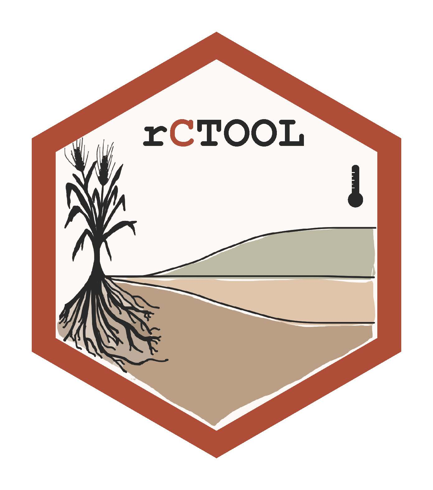

<!-- README.md is generated from README.Rmd. Please edit that file -->

```{r, include = FALSE}
knitr::opts_chunk$set(
  collapse = TRUE,
  comment = "#>",
  fig.path = "man/figures/README-",
  out.width = "100%"
)
```

# rCTOOL

<!-- badges: start -->
<!-- badges: end -->

rCTOOL is an open-source R package for running C-TOOL simulations of soil organic carbon dynamics in agricultural systems. It provides a user-friendly R interface for defining carbon inputs, management schedules, soil parameters, temperature forcing, scenario simulations, and parameter calibration.

The package builds on the C-TOOL model framework [@petersen1ctool; @tagctool2] and aims to make C-TOOL-based simulations easier to configure, reproduce, document, and extend.
```{r rCTOOLicon, echo=FALSE, out.width="50%",fig.align = 'center'}

```

## Installation

Once available on CRAN, rCTOOL can be installed with:

```{r, eval = FALSE, message = FALSE}
install.packages("rCTOOL")
```
The development version can be installed from GitHub:
``` {r, eval = FALSE, message = FALSE}
# install.packages("devtools")
devtools::install_github("francagiannini/rCTOOL")
```

## Basic example

This is a simple example of the potential use of rCTOOL. 
The example corresponds to one of the treatments presented by [@jensen21] and [@jensen22]
containing the C inputs for the treatment of the spring barley crop with 4 DM Mg/ha straw incorporated into the soil at a long-term experimental station Askov, Denmark. 

```{r, message = FALSE, warning = FALSE}
library(rCTOOL)
library(ggplot2)

# load data ----
data('basic_example')
data('scenario_temperature')
```
The `basic_example` dataset contains annual carbon inputs and monthly management allocation information.
```{r }
head(basic_example, 2)
```
The `scenario_temperature` dataset contains monthly temperature data.
```{r }
head(scenario_temperature, 2)
```

A standard rCTOOL simulation requires five main inputs:

1. simulation period;
2. carbon inputs;
3. management configuration;
4. soil configuration;
5. temperature configuration.
```{r }
# define timeperiod 
period <- define_timeperiod(
  yr_start = 1951,
  yr_end = 2019
  )

# get annual Carbon inputs 
cin <- define_Cinputs(
  management_filepath = basic_example
  )

# get management 
management <- management_config(
  management_filepath = basic_example,
  grain_monthly_allocation = rep(0, 12),
  grass_monthly_allocation = rep(0, 12),
  f_man_humification = 0.192
)

# get soil configuration 
soil <- soil_config(Csoil_init = 105, 
                   f_hum_top =  0.533,
                   f_rom_top =  0.405,
                   f_hum_sub =  0.387,
                   f_rom_sub =  0.610,
                   Cproptop = 0.55,
                   clay_top = 0.11,
                   clay_sub = 0.20,
                   phi = 0.035,
                   f_co2 = 0.628,
                   f_romi = 0.012,
                   k_fom  = 0.12,
                   k_hum = 0.0028,
                   k_rom = 3.85e-5,
                   ftr = 0.0025
                   )
```
Initial soil pools are calculated before running the simulation. They depend on the initial soil carbon stock, the initial C:N ratio, and the distribution of carbon among FOM, HUM, and ROM pools.
```{r}
# initialize soil pools
soil_pools <- initialize_soil_pools(
  cn = 12,
  soil_config = soil
)

soil_pools <- c(soil_pools[[1]], soil_pools[[2]])
```

The monthly simulation is then run with `run_ctool()`. The `verbose` argument can be used to run additional diagnostic checks during the simulation.

```{r}
# run rCTOOL
output <- run_ctool(
  time_config = period,
  cin_config = cin,
  m_config = management,
  t_config = scenario_temperature,
  s_config = soil,
  soil_pools = soil_pools,
  verbose = FALSE
)
```

The resulting output contains monthly carbon pools, soil carbon stocks, transport fluxes, and CO2 emissions.

```{r}
head(output)
```
The topsoil SOC trajectory can be visualized as follows.

```{r basic-soc-plot, message = FALSE, warning = FALSE}
output$time <- as.Date(
  paste(output$yrs, output$mon, "01", sep = "-")
)

ggplot(output, aes(x = time, y = C_topsoil)) +
  geom_line() +
  geom_smooth() +
  theme_classic() +
  labs(
    x = "Year",
    y = "Topsoil SOC stock (Mg C ha-1)"
  )
```
## Output variables

The rCTOOL output includes time, carbon stocks, pool sizes, transport fluxes, and CO2 emissions.

### Time variables:

- `mon`: month of the year (1-12);
- `yrs`: year of the simulation.

### Soil carbon stocks and profile-level fluxes (Mg/ha):

- `C_topsoil`: carbon stock in the topsoil (0-25 cm).
- `C_subsoil`: carbon stock in the subsoil (26-100 cm).
- `SOC_stock`: total Soil Organic Carbon stock in the soil (0-100 cm).
- `C_transport`: carbon transported to the subsoil.
- `em_CO2_top`: total CO2 emissions from the topsoil.
- `em_CO2_sub`: total CO2 emissions from the subsoil.
- `em_CO2_total`: total CO2 emissions from the soil.


### Fresh Organic Matter (FOM) pool:

- `FOM_top`: FOM in the topsoil.
- `FOM_top_decomposition`: monthly decomposition of FOM in the topsoil.
- `substrate_FOM_decomp_top`: substrate for FOM decomposition in the topsoil.
- `FOM_humified_top`: FOM that has been "humified" in the topsoil 
   (becomes part of topsoil HUM).
- `em_CO2_FOM_top`: CO2 emissions from the decomposition of FOM in the topsoil.
- `FOM_tr`: FOM transported from the topsoil to the subsoil.
- `FOM_sub`: FOM in the subsoil.
- `FOM_sub_decomposition`: decomposition of FOM in the subsoil.
- `substrate_FOM_decomp_sub`: substrate for FOM decomposition in the subsoil.
- `FOM_humified_sub`: FOM that has been "humified" in the subsoil 
   (becomes part of subsoil HUM).
- `em_CO2_FOM_sub`: CO2 emissions from the decomposition of FOM in the subsoil.

### Humified Organic Matter (HUM) pool:

- `HUM_top`: HUM in the topsoil.
- `HUM_top_decomposition`: Decomposition of HUM in the topsoil.
- `substrate_HUM_decomp_top`: Substrate for HUM decomposition in the topsoil.
- `HUM_romified_top`: HUM that has been "romified" in the topsoil 
   (becomes part of topsoil ROM).
- `em_CO2_HUM_top`: CO2 emissions from the decomposition of HUM in the topsoil.
- `HUM_tr`: HUM transported from the topsoil to the subsoil.
- `HUM_sub`: HUM in the subsoil.
- `HUM_sub_decomposition`: Decomposition of HUM in the subsoil.
- `substrate_HUM_decomp_sub`: Substrate for HUM decomposition in the subsoil.
- `HUM_romified_sub`: HUM that has been "romified" in the subsoil 
   (becomes part of subsoil ROM).
- `em_CO2_HUM_sub`: CO2 emissions from the decomposition of HUM in the subsoil.

### Resistant Organic Matter (ROM) pool:

- `ROM_top`: ROM in the topsoil.
- `ROM_top_decomposition`: Decomposition of ROM in the topsoil.
- `substrate_ROM_decomp_top`: Substrate for ROM decomposition in the topsoil.
- `em_CO2_ROM_top`: CO2 emissions from the decomposition of ROM in the topsoil.
- `ROM_tr`: ROM transported from the topsoil to the subsoil.
- `ROM_sub`: ROM in the subsoil.
- `ROM_sub_decomposition`: Decomposition of ROM in the subsoil.
- `substrate_ROM_decomp_sub`: Substrate for ROM decomposition in the subsoil.
- `em_CO2_ROM_sub`: CO2 emissions from the decomposition of ROM in the subsoil.

## Parameter calibration

rCTOOL includes a calibration module for evaluating and calibrating selected CTOOL parameters against observed SOC stocks.

The current calibration module tests combinations of:

- `f_hum_top`: fraction of decomposed topsoil FOM entering the HUM pool;
- `k_hum`: decomposition rate of the HUM pool.

For each tested value of `f_hum_top`, the corresponding `f_rom_top` is calculated internally as:

```{r, eval = FALSE}
f_rom_top = 1 - f_hum_top - f_fom_top
```
The only additional data required for calibration is a two-column data frame containing observed SOC stocks by year. In this example, we create a small artificial observed dataset from the simulated output only to demonstrate the workflow.

```{r}
observed <- aggregate(
  C_topsoil ~ yrs,
  data = output,
  FUN = mean
)

observed <- data.frame(
  Year = observed$yrs + 1,
  SOC_obs = observed$C_topsoil
)

observed <- observed[observed$Year %in% c(1955, 1965, 1975, 1985, 1995), ]

observed
```
The tested parameter ranges are defined using `min`, `max`, and `by`.

```{r}
calib <- ctool_calibrate(
  time_config = period,
  cinput_config = cin,
  temperature_config = scenario_temperature,
  management_config = management,
  soil_config = soil,
  observed = observed,
  f_hum_top = c(min = 0.20, max = 0.60, by = 0.10),
  k_hum = c(min = 0.0020, max = 0.0040, by = 0.0010),
  verbose = FALSE
)

summary(calib)
```

The calibration output includes:

- the current CTOOL parameter performance;
- the best tested calibration;
- a recommended parameter set;
- full metrics for all tested parameter combinations.

Model performance is evaluated using RMSE, MAE, mean bias, R2, and the Willmott index of agreement, reported as `d_index` [@willmott1981].

```{r}
calib$recommended_params
```

If the current CTOOL parameters perform as well as or better than the tested calibration grid, `ctool_calibrate()` recommends keeping the current parameter set.


## Comparing multiple scenarios

rCTOOL can also be used to compare multiple management or land-use scenarios. The following example uses the `scenario` dataset.

```{r, message = FALSE, warning=FALSE}
data('scenario')
data('scenario_temperature')
```

The `scenario` dataset contains different C input assumptions for different management s options. 

- For the football court scenario we assume a well-maintained stomped ryegrass cover, 

- for the organic dairy farming we assume a crop rotation with grass, maize and cereals for happy milking cows,  

- and finally for the pet cemetery we assume a less healthily reygrass and a certain number of beloved dogs   and cats from Viborg municipality burred in the subsoil.  

Now we will play with rCTOOL to explore the implications in terms of soil C dynamics.

First lets take a look on the C inputs distribution: 

```{r}
period <- define_timeperiod(
  yr_start = 1951,
  yr_end = 2019
)

management <- management_config(
  manure_monthly_allocation = c(0, 0, 1, 0, 0, 0, 0, 0, 0, 0, 0, 0),
  plant_monthly_allocation = c(0, 0, 0, 8, 12, 16, 64, 0, 0, 0, 0, 0) / 100,
  grain_monthly_allocation = rep(0, 12),
  grass_monthly_allocation = rep(0, 12),
  f_man_humification = 0
)

soil <- soil_config(
  Csoil_init = 100,
  f_hum_top = 0.4803,
  f_rom_top = 0.4881,
  f_hum_sub = 0.3123,
  f_rom_sub = 0.6847,
  Cproptop = 0.47,
  clay_top = 0.1,
  clay_sub = 0.15,
  phi = 0.035,
  f_co2 = 0.628,
  f_romi = 0.012,
  k_fom = 0.12,
  k_hum = 0.0028,
  k_rom = 3.85e-5,
  ftr = 0.003
)

soil_pools <- initialize_soil_pools(
  cn = 10,
  soil_config = soil
)
```

Then define carbon inputs and run the model for each scenario.

```{r}
treatment <- unique(scenario$treatment)

cin_treatment <- lapply(treatment, function(x) {
  define_Cinputs(
    management_filepath = subset(scenario, treatment == x)
  )
})

names(cin_treatment) <- treatment

output_treatment <- lapply(treatment, function(x) {
  out <- run_ctool(
    time_config = period,
    cin_config = cin_treatment[[x]],
    m_config = management,
    t_config = scenario_temperature,
    s_config = soil,
    soil_pools = soil_pools,
    verbose = FALSE
  )

  out$treatment <- x
  out
})

output_treatment <- data.table::rbindlist(output_treatment)
```

The simulated trajectories can then be compared across scenarios.

```{r scenario-plot, message = FALSE, warning = FALSE}
plot_df <- output_treatment[
  ,
  c("mon", "yrs", "C_topsoil", "C_subsoil", "em_CO2_total", "treatment")
]

plot_df <- reshape2::melt(
  plot_df,
  id.vars = c("mon", "yrs", "treatment")
)

labels <- c(
  C_topsoil = "SOC topsoil",
  C_subsoil = "SOC subsoil",
  em_CO2_total = "CO2 emissions"
)

ggplot(plot_df, aes(x = yrs, y = value, colour = treatment)) +
  geom_point(size = 0.02, alpha = 0.2) +
  geom_smooth() +
  facet_wrap(
    variable ~ .,
    scales = "free_y",
    ncol = 1,
    labeller = as_labeller(labels)
  ) +
  labs(
    x = "Year",
    y = "Output (Mg ha-1)",
    colour = "Treatment"
  ) +
  theme_classic()
```

# References
