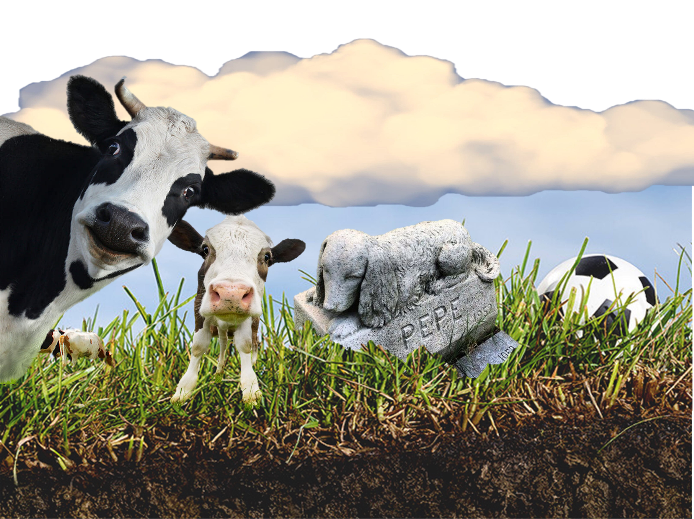

<!-- README.md is generated from README.Rmd. Please edit that file -->

```{r, include = FALSE}
knitr::opts_chunk$set(
  collapse = TRUE,
  comment = "#>",
  fig.path = "man/figures/README-",
  out.width = "100%"
)
```

# rCTOOL

<!-- badges: start -->
<!-- badges: end -->

rCTOOL is an open-source R package, that encapsulates the capabilities of C-TOOL [@petersen1ctool;@tagctool2] while addressing its implementation limitations. The aim consists of providing a user-friendly interface, facilitates running multiple scenarios, and offers comprehensive documentation and licensing information. This package streamlines the use of C-TOOL, making it more accessible and effective for potential users.

```{r rCTOOLicon, echo=FALSE, out.width="50%",fig.align = 'center'}
knitr::include_graphics("man/figures/rCTOOLicon.jpg")
```

## Installation

You can install the development version of rCTOOL from [GitHub](https://github.com/) with:

``` {r, eval = FALSE, message = FALSE}
# install.packages("devtools")
devtools::install_github("francagiannini/rCTOOL")
```

## Basic toy example

This is a simple example of the potential use of rCTOOL. 
The example corresponds to one of the treatments presented by [@jensen21] and [@jensen22]
containing the C inputs for the treatment of the spring barley crop with 4 DM Mg/ha straw incorporated into the soil at a long-term experimental station Askov, Denmark. 

```{r, message = FALSE, warning = FALSE}
library(rCTOOL)
library(tidyverse)

# load data ----
data('basic_example')
data('scenario_temperature') # this is equivalent to set_monthly_temperature_data(coords=c(9.114015, 55.47163), yr_start=1951, yr_end=2019)
```

Below the basic_example and temperature data sets are exemplified.
```{r }
head(basic_example, 2)
```
```{r }
head(scenario_temperature, 2)
```

It is mandatory to define the time period, Carbon inputs (from manure and/or plant), Management (months where the inputs are applied) and soil configurations as well as temperature.

In this basic example, the temperature was already exported using the package "easyclimate" for 1951-2019; basic_example contains the annual C inputs from manure and plants, as well as their respective monthly allocations.
```{r }
# define timeperiod 
period <- define_timeperiod(yr_start = 1951, yr_end = 2019)

# get annual Carbon inputs 
cin <- define_Cinputs(management_filepath = basic_example)

# get management 
management <- management_config(management_filepath = basic_example, f_man_humification = 0.192)

# get soil configuration 
soil <- soil_config(Csoil_init = 105, # Initial C stock at 1m depth
                   f_hum_top =  0.533,
                   f_rom_top =  0.405,
                   f_hum_sub =  0.387,
                   f_rom_sub =  0.610,
                   Cproptop = 0.55, # landmarkensite report askov
                   clay_top = 0.11,
                   clay_sub = 0.20,
                   phi = 0.035,
                   f_co2 = 0.628,
                   f_romi = 0.012,
                   k_fom  = 0.12,
                   k_hum = 0.0028,
                   k_rom = 3.85e-5,
                   ftr = 0.0025)
```

We also need to initialize soil pools before the simulation starts. Initial soil pools depend on the Carbon:Nitrogen ratio, the humification and romification fractions in top- and subsoils as well as the initial C stock.
```{r }
# initialize soil pools
soil_pools <- initialize_soil_pools(cn = 12, soil_config = soil)
```

We can now start the monthly simulation. The verbose argument, currently set to FALSE, provides a check mass-balance to ensure the model is working correctly.
[Note to improve the mass balance, currently wrong]
```{r }
# run rCTOOL
output <- run_ctool(time_config = period,
                   cin_config = cin,
                   m_config = management,
                   t_config = scenario_temperature,
                   s_config = soil,
                   soil_pools = soil_pools,
                   verbose = F)
```

We can plot the results.
```{r pressure, echo = TRUE, message = FALSE}
output |>
  mutate(time=make_date(year =yrs,month=mon)) |>
  ggplot(aes(x=time,y=C_topsoil))+
  geom_line()+
  geom_smooth()+
  theme_classic()
```


## Comparing multiple scenario toy example

Aiming to show how to run and compare multiple scenarios, 
we have set ourselves the following challenge:

We have inherited an old field where cereals have been grown for many many years and we want to increase C in Soil. We need to choose between...


- Creating a football pitch for students at AU Viborg recreation.

- Starting an organic dairy farm.

- Establishing a municipal (kommunal) pet cemetery…

```{r openhousefigure, echo=FALSE}

```

Loading scenario management data for the there options. 
```{r}
# load data ----
data('scenario')
data('scenario_temperature') # this is equivalent to set_monthly_temperature_data(coords=c(9.114015, 55.47163), yr_start=1951, yr_end=2019)
```

The scenario data set contains three different C input estimation for the different scenarios: 

- For the football court scenario we assume a well-maintained stomped ryegrass cover, 

- for the organic dairy farming we assume a crop rotation with grass, maize and cereals for happy milking cows,  

- and finally for the pet cemetery we assume a less healthily reygrass and a certain number of beloved dogs   and cats from Viborg municipality burred in the subsoil.  

Now we will play with rCTOOL to explore the implications in terms of soil C dynamics.

First lets take a look on the C inputs distribution: 

```{r ,echo = FALSE, message = FALSE, warning=FALSE}
require('ggplot2')

plot_df  <-  reshape2::melt(scenario, c('mon','yrs','id','treatment'))
plot_df <- plot_df |> 
  group_by(yrs, treatment, variable) |> 
  summarize(value=mean(value))

ggplot(data = subset(plot_df, value != 0),
       aes(x = yrs, y = value, colour = treatment)) +
  geom_line(size = .8) +
  facet_wrap(variable ~ ., scales = "free_y", ncol = 1, ) +
  labs(x = 'Management', y = 'Carbon inputs (tonnes/ha)', colour = 'Treatment')+
  theme_classic() 
```

Then we provide a simulation parameters to the different modules time period, management, soil parameters and pools initial distribution.

```{r}
period <-  define_timeperiod(yr_start = 1951, yr_end = 2019)

management <- management_config(
  manure_monthly_allocation = c(0, 0, 1, 0, 0, 0, 0, 0, 0, 0, 0, 0),
  plant_monthly_allocation = c(0, 0, 0, 8, 12, 16, 64, 0, 0, 0, 0, 0) / 100
) # set to default

soil <- soil_config(Csoil_init = 100,
                   f_hum_top = 0.4803,
                   f_rom_top = 0.4881,
                   f_hum_sub = 0.3123,
                   f_rom_sub = 0.6847,
                   Cproptop = 0.47,
                   clay_top = 0.1,
                   clay_sub = 0.15,
                   phi = 0.035,
                   f_co2 = 0.628,
                   f_romi = 0.012,
                   k_fom  = 0.12,
                   k_hum = 0.0028, 
                   k_rom = 3.85e-5,
                   ftr = 0.003)

soil_pools <- initialize_soil_pools(cn = 10, soil_config = soil)
```

Then we provide configuration for running each of the three treatment/scenarios.

```{r}
treatment <- unique(scenario$treatment)
cin_treatment <- lapply(treatment, function(x) { define_Cinputs(management_filepath = subset(scenario, treatment==x)) })
names(cin_treatment) <- treatment
```

Finally we run the simulation for each treatment/scenario.

```{r}
output_treatment <- lapply(treatment, function(x) {
  output <- run_ctool(time_config = period, 
            cin_config = cin_treatment[[x]], 
            m_config = management, 
            t_config = scenario_temperature, 
            s_config = soil, 
            soil_pools = soil_pools)
  output$treatment = x
  return(output)
})

output_treatment <- data.table::rbindlist(output_treatment)
```

And the winning one is...

Lets explore:

```{r echo = FALSE, message = FALSE}

plot_df <- output_treatment[, c('mon','yrs','C_topsoil','C_subsoil','em_CO2_total', 'treatment')]
plot_df <- reshape2::melt(plot_df, c('mon','yrs','treatment'))

labels <- c(
  C_topsoil = 'SOC topsoil',
  C_subsoil = 'SOC subsoil',
  em_CO2_total = 'CO2 emissions'
)

ggplot(plot_df, aes(x=yrs, y=value, colour=treatment)) + 
  geom_point(size=0.02, alpha=0.2) + 
  geom_smooth() +
  facet_wrap(variable~., scales = 'free_y', ncol = 1,
             labeller = as_labeller(labels)) + 
  labs(x='Years', y='Output (tonnes/ha)', colour='Treatment') + 
  scale_x_continuous(breaks=c(1960, 2010))+ 
  theme_classic() 
```

# References
