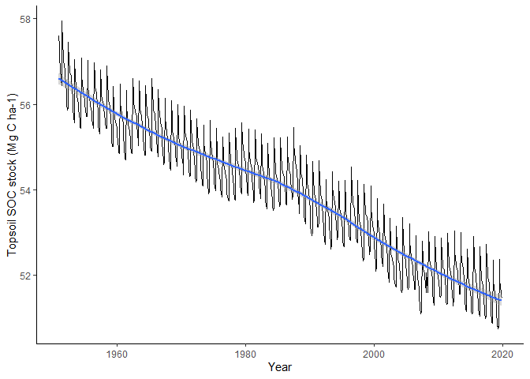
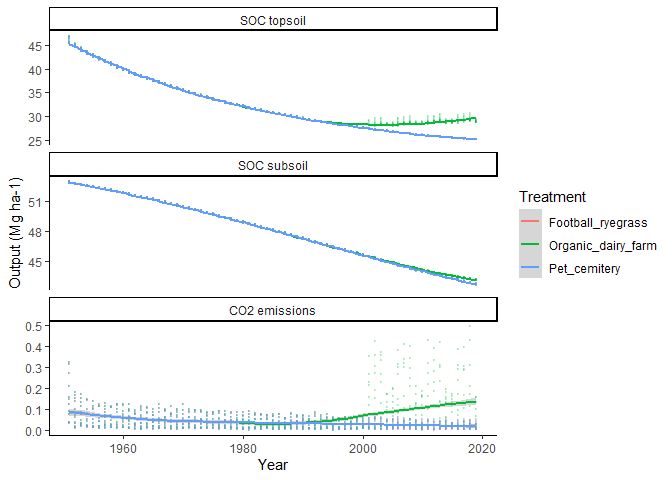

<!-- README.md is generated from README.Rmd. Please edit that file -->

# rCTOOL

<!-- badges: start -->

<!-- badges: end -->

rCTOOL is an open-source R package for running C-TOOL simulations of
soil organic carbon dynamics in agricultural systems. It provides a
user-friendly R interface for defining carbon inputs, management
schedules, soil parameters, temperature forcing, scenario simulations,
and parameter calibration.

The package builds on the C-TOOL model framework (Petersen, Olesen, and
Heidmann 2002; Taghizadeh-Toosi et al. 2014) and aims to make
C-TOOL-based simulations easier to configure, reproduce, document, and
extend.


## Installation

Once available on CRAN, rCTOOL can be installed with:

``` r
install.packages("rCTOOL")
```

The development version can be installed from GitHub:

``` r
# install.packages("devtools")
devtools::install_github("francagiannini/rCTOOL")
```

## Basic example

This is a simple example of the potential use of rCTOOL. The example
corresponds to one of the treatments presented by (Jensen et al. 2021)
and (Jensen et al. 2022) containing the C inputs for the treatment of
the spring barley crop with 4 DM Mg/ha straw incorporated into the soil
at a long-term experimental station Askov, Denmark.

``` r
library(rCTOOL)
library(ggplot2)

# load data ----
data('basic_example')
data('scenario_temperature')
```

The `basic_example` dataset contains annual carbon inputs and monthly
management allocation information.

``` r
head(basic_example, 2)
#>   mon  yrs id year Cin_top Cin_sub Cin_man manure_monthly_allocation
#> 1   1 1951  1 1951   3.566    0.39       0                         0
#> 2   2 1951  1 1952   3.566    0.39       0                         0
#>   plant_monthly_allocation
#> 1                        0
#> 2                        0
```

The `scenario_temperature` dataset contains monthly temperature data.

``` r
head(scenario_temperature, 2)
#>   month   yr     Tavg
#> 1     1 1951 0.890000
#> 2     2 1951 1.170714
```

A standard rCTOOL simulation requires five main inputs:

1.  simulation period;
2.  carbon inputs;
3.  management configuration;
4.  soil configuration;
5.  temperature configuration.

``` r
# define timeperiod 
period <- define_timeperiod(
  yr_start = 1951,
  yr_end = 2019
  )

# get annual Carbon inputs 
cin <- define_Cinputs(
  management_filepath = basic_example
  )

# get management 
management <- management_config(
  management_filepath = basic_example,
  grain_monthly_allocation = rep(0, 12),
  grass_monthly_allocation = rep(0, 12),
  f_man_humification = 0.192
)

# get soil configuration 
soil <- soil_config(Csoil_init = 105, 
                   f_hum_top =  0.533,
                   f_rom_top =  0.405,
                   f_hum_sub =  0.387,
                   f_rom_sub =  0.610,
                   Cproptop = 0.55,
                   clay_top = 0.11,
                   clay_sub = 0.20,
                   phi = 0.035,
                   f_co2 = 0.628,
                   f_romi = 0.012,
                   k_fom  = 0.12,
                   k_hum = 0.0028,
                   k_rom = 3.85e-5,
                   ftr = 0.0025
                   )
```

Initial soil pools are calculated before running the simulation. They
depend on the initial soil carbon stock, the initial C:N ratio, and the
distribution of carbon among FOM, HUM, and ROM pools.

``` r
# initialize soil pools
soil_pools <- initialize_soil_pools(
  cn = 12,
  soil_config = soil
)

soil_pools <- c(soil_pools[[1]], soil_pools[[2]])
```

The monthly simulation is then run with `run_ctool()`. The `verbose`
argument can be used to run additional diagnostic checks during the
simulation.

``` r
# run rCTOOL
output <- run_ctool(
  time_config = period,
  cin_config = cin,
  m_config = management,
  t_config = scenario_temperature,
  s_config = soil,
  soil_pools = soil_pools,
  verbose = FALSE
)
```

The resulting output contains monthly carbon pools, soil carbon stocks,
transport fluxes, and CO2 emissions.

``` r
head(output)
#>   mon  yrs  FOM_top FOM_top_decomposition substrate_FOM_decomp_top
#> 1   1 1951 3.435048            -0.1454518                0.1454518
#> 2   2 1951 3.195740            -0.2393079                0.2393079
#> 3   3 1951 2.915547            -0.2801936                0.2801936
#> 4   4 1951 2.668412            -0.5324143                0.5324143
#> 5   5 1951 2.416203            -0.6801291                0.6801291
#> 6   6 1951 2.267384            -0.7193794                0.7193794
#>   FOM_humified_top em_CO2_FOM_top       FOM_tr   FOM_sub FOM_sub_decomposition
#> 1       0.02782131      0.1172668 0.0003636294 0.1375258          -0.004587808
#> 2       0.04577366      0.1929360 0.0005982698 0.1307436          -0.007380504
#> 3       0.05359408      0.2258990 0.0007004840 0.1223929          -0.009051156
#> 4       0.10183764      0.4292456 0.0013310358 0.1324329          -0.022491038
#> 5       0.13009180      0.5483369 0.0017003226 0.1425719          -0.038361325
#> 6       0.13759943      0.5799816 0.0017984486 0.1540850          -0.052685398
#>   substrate_FOM_decomp_sub FOM_humified_sub em_CO2_FOM_sub  HUM_top
#> 1              0.004587808     0.0009878393    0.003599969 25.95689
#> 2              0.007380504     0.0015891579    0.005791346 25.96039
#> 3              0.009051156     0.0019488800    0.007102276 25.96077
#> 4              0.022491038     0.0048427332    0.017648305 25.96145
#> 5              0.038361325     0.0082598971    0.030101428 25.95782
#> 6              0.052685398     0.0113441328    0.041341265 25.94876
#>   HUM_top_decomposition substrate_HUM_decomp_top HUM_romified_top
#> 1           -0.02462729               0.02462729     0.0002955275
#> 2           -0.04226870               0.04226870     0.0005072243
#> 3           -0.05321946               0.05321946     0.0006386335
#> 4           -0.10115380               0.10115380     0.0012138456
#> 5           -0.13372738               0.13372738     0.0016047285
#> 6           -0.14665546               0.14665546     0.0017598655
#>   em_CO2_HUM_top      HUM_tr  HUM_sub HUM_sub_decomposition
#> 1     0.01546594 0.008865824 15.42058           -0.01162135
#> 2     0.02654474 0.015216730 15.42507           -0.01924719
#> 3     0.03342182 0.019159005 15.43030           -0.02481767
#> 4     0.06352458 0.036415367 15.43801           -0.05240850
#> 5     0.08398079 0.048141856 15.44536           -0.07665266
#> 6     0.09209963 0.052795966 15.45048           -0.09220968
#>   substrate_HUM_decomp_sub HUM_romified_sub em_CO2_HUM_sub  ROM_top
#> 1               0.01162135     0.0001394562    0.007298207 28.21587
#> 2               0.01924719     0.0002309662    0.012087233 28.21598
#> 3               0.02481767     0.0002978120    0.015585495 28.21612
#> 4               0.05240850     0.0006289019    0.032912535 28.21638
#> 5               0.07665266     0.0009198319    0.048137870 28.21673
#> 6               0.09220968     0.0011065161    0.057907677 28.21712
#>   ROM_top_decomposition substrate_ROM_decomp_top em_CO2_ROM_top       ROM_tr
#> 1         -0.0003677493             0.0003677493   0.0002309465 9.193731e-07
#> 2         -0.0006306740             0.0006306740   0.0003960633 1.576685e-06
#> 3         -0.0007937270             0.0007937270   0.0004984605 1.984317e-06
#> 4         -0.0015058543             0.0015058543   0.0009456765 3.764636e-06
#> 5         -0.0019886082             0.0019886082   0.0012488460 4.971521e-06
#> 6         -0.0021805722             0.0021805722   0.0013693994 5.451431e-06
#>    ROM_sub ROM_sub_decomposition substrate_ROM_decomp_sub em_CO2_ROM_sub
#> 1 31.69002         -0.0003282270             0.0003282270   0.0002061265
#> 2 31.68991         -0.0005432775             0.0005432775   0.0003411783
#> 3 31.68977         -0.0007001122             0.0007001122   0.0004396704
#> 4 31.68947         -0.0014760401             0.0014760401   0.0009269532
#> 5 31.68904         -0.0021556707             0.0021556707   0.0013537612
#> 6 31.68853         -0.0025906327             0.0025906327   0.0016269173
#>   C_topsoil C_subsoil SOC_stock C_transport em_CO2_top em_CO2_sub em_CO2_total
#> 1  57.60781  47.24813  104.8559 0.009230373  0.1329637 0.01110430    0.1440680
#> 2  57.37211  47.24572  104.6178 0.015816577  0.2198768 0.01821976    0.2380965
#> 3  57.09243  47.24246  104.3349 0.019861474  0.2598193 0.02312744    0.2829468
#> 4  56.84625  47.25992  104.1062 0.037750168  0.4937159 0.05148779    0.5452037
#> 5  56.59075  47.27697  103.8677 0.049847151  0.6335666 0.07959306    0.7131596
#> 6  56.43326  47.29310  103.7264 0.054599866  0.6734506 0.10087586    0.7743265
```

The topsoil SOC trajectory can be visualized as follows.

``` r
output$time <- as.Date(
  paste(output$yrs, output$mon, "01", sep = "-")
)

ggplot(output, aes(x = time, y = C_topsoil)) +
  geom_line() +
  geom_smooth() +
  theme_classic() +
  labs(
    x = "Year",
    y = "Topsoil SOC stock (Mg C ha-1)"
  )
```

 \##
Output variables

The rCTOOL output includes time, carbon stocks, pool sizes, transport
fluxes, and CO2 emissions.

### Time variables:

- `mon`: month of the year (1-12);
- `yrs`: year of the simulation.

### Soil carbon stocks and profile-level fluxes (Mg/ha):

- `C_topsoil`: carbon stock in the topsoil (0-25 cm).
- `C_subsoil`: carbon stock in the subsoil (26-100 cm).
- `SOC_stock`: total Soil Organic Carbon stock in the soil (0-100 cm).
- `C_transport`: carbon transported to the subsoil.
- `em_CO2_top`: total CO2 emissions from the topsoil.
- `em_CO2_sub`: total CO2 emissions from the subsoil.
- `em_CO2_total`: total CO2 emissions from the soil.

### Fresh Organic Matter (FOM) pool:

- `FOM_top`: FOM in the topsoil.
- `FOM_top_decomposition`: monthly decomposition of FOM in the topsoil.
- `substrate_FOM_decomp_top`: substrate for FOM decomposition in the
  topsoil.
- `FOM_humified_top`: FOM that has been “humified” in the topsoil
  (becomes part of topsoil HUM).
- `em_CO2_FOM_top`: CO2 emissions from the decomposition of FOM in the
  topsoil.
- `FOM_tr`: FOM transported from the topsoil to the subsoil.
- `FOM_sub`: FOM in the subsoil.
- `FOM_sub_decomposition`: decomposition of FOM in the subsoil.
- `substrate_FOM_decomp_sub`: substrate for FOM decomposition in the
  subsoil.
- `FOM_humified_sub`: FOM that has been “humified” in the subsoil
  (becomes part of subsoil HUM).
- `em_CO2_FOM_sub`: CO2 emissions from the decomposition of FOM in the
  subsoil.

### Humified Organic Matter (HUM) pool:

- `HUM_top`: HUM in the topsoil.
- `HUM_top_decomposition`: Decomposition of HUM in the topsoil.
- `substrate_HUM_decomp_top`: Substrate for HUM decomposition in the
  topsoil.
- `HUM_romified_top`: HUM that has been “romified” in the topsoil
  (becomes part of topsoil ROM).
- `em_CO2_HUM_top`: CO2 emissions from the decomposition of HUM in the
  topsoil.
- `HUM_tr`: HUM transported from the topsoil to the subsoil.
- `HUM_sub`: HUM in the subsoil.
- `HUM_sub_decomposition`: Decomposition of HUM in the subsoil.
- `substrate_HUM_decomp_sub`: Substrate for HUM decomposition in the
  subsoil.
- `HUM_romified_sub`: HUM that has been “romified” in the subsoil
  (becomes part of subsoil ROM).
- `em_CO2_HUM_sub`: CO2 emissions from the decomposition of HUM in the
  subsoil.

### Resistant Organic Matter (ROM) pool:

- `ROM_top`: ROM in the topsoil.
- `ROM_top_decomposition`: Decomposition of ROM in the topsoil.
- `substrate_ROM_decomp_top`: Substrate for ROM decomposition in the
  topsoil.
- `em_CO2_ROM_top`: CO2 emissions from the decomposition of ROM in the
  topsoil.
- `ROM_tr`: ROM transported from the topsoil to the subsoil.
- `ROM_sub`: ROM in the subsoil.
- `ROM_sub_decomposition`: Decomposition of ROM in the subsoil.
- `substrate_ROM_decomp_sub`: Substrate for ROM decomposition in the
  subsoil.
- `em_CO2_ROM_sub`: CO2 emissions from the decomposition of ROM in the
  subsoil.

## Parameter calibration

rCTOOL includes a calibration module for evaluating and calibrating
selected CTOOL parameters against observed SOC stocks.

The current calibration module tests combinations of:

- `f_hum_top`: fraction of decomposed topsoil FOM entering the HUM pool;
- `k_hum`: decomposition rate of the HUM pool.

For each tested value of `f_hum_top`, the corresponding `f_rom_top` is
calculated internally as:

``` r
f_rom_top = 1 - f_hum_top - f_fom_top
```

The only additional data required for calibration is a two-column data
frame containing observed SOC stocks by year. In this example, we create
a small artificial observed dataset from the simulated output only to
demonstrate the workflow.

``` r
observed <- aggregate(
  C_topsoil ~ yrs,
  data = output,
  FUN = mean
)

observed <- data.frame(
  Year = observed$yrs + 1,
  SOC_obs = observed$C_topsoil
)

observed <- observed[observed$Year %in% c(1955, 1965, 1975, 1985, 1995), ]

observed
#>    Year  SOC_obs
#> 4  1955 56.10409
#> 14 1965 55.52216
#> 24 1975 54.62216
#> 34 1985 54.16431
#> 44 1995 53.38794
```

The tested parameter ranges are defined using `min`, `max`, and `by`.

``` r
calib <- ctool_calibrate(
  time_config = period,
  cinput_config = cin,
  temperature_config = scenario_temperature,
  management_config = management,
  soil_config = soil,
  observed = observed,
  f_hum_top = c(min = 0.20, max = 0.60, by = 0.10),
  k_hum = c(min = 0.0020, max = 0.0040, by = 0.0010),
  verbose = FALSE
)

summary(calib)
#> C-TOOL calibration summary
#> =========================
#> 
#> Calibration data:
#>   Observations: 5
#>   Tested combinations: 15
#> 
#> Calibrated parameters:
#>   f_hum_top
#>   k_hum
#> 
#> Parameter ranges:
#>   f_hum_top: 0.2 to 0.6 by 0.1
#>   k_hum: 0.002 to 0.004 by 0.001
#> 
#> Calibration settings:
#>   f_fom_top: 0.003
#>   cn_init: 10
#>   Ranking metric: d_index
#>   Minimize metric: FALSE
#> 
#> Best tested calibration:
#>  f_hum_top k_hum f_rom_top   d_index     RMSE        R2      Bias       MAE n
#>        0.4 0.004     0.597 0.8678099 1.038007 0.9781859 0.4954844 0.7633362 5
#> 
#> Current parameters versus best tested calibration:
#>                       Type   d_index     RMSE        R2       Bias       MAE n
#>  Current C-TOOL parameters 0.5768270 2.460624 0.9908253 -2.2206482 2.2206482 5
#>    Best tested calibration 0.8678099 1.038007 0.9781859  0.4954844 0.7633362 5
#>  f_hum_top  k_hum f_rom_top
#>      0.533 0.0028     0.405
#>      0.400 0.0040     0.597
#> 
#> Recommended parameter set:
#>                   Source f_hum_top k_hum f_rom_top   d_index     RMSE        R2
#>  Best tested calibration       0.4 0.004     0.597 0.8678099 1.038007 0.9781859
#>       Bias       MAE n
#>  0.4954844 0.7633362 5
#> 
#> Recommendation:
#>   Use the best tested calibration because it improved the selected performance metric compared with the current C-TOOL parameters.
```

The calibration output includes:

- the current CTOOL parameter performance;
- the best tested calibration;
- a recommended parameter set;
- full metrics for all tested parameter combinations.

Model performance is evaluated using RMSE, MAE, mean bias, R2, and the
Willmott index of agreement, reported as `d_index` (Willmott 1981).

``` r
calib$recommended_params
#>                    Source f_hum_top k_hum f_rom_top   d_index     RMSE
#> 1 Best tested calibration       0.4 0.004     0.597 0.8678099 1.038007
#>          R2      Bias       MAE n
#> 1 0.9781859 0.4954844 0.7633362 5
```

If the current CTOOL parameters perform as well as or better than the
tested calibration grid, `ctool_calibrate()` recommends keeping the
current parameter set.

## Comparing multiple scenarios

rCTOOL can also be used to compare multiple management or land-use
scenarios. The following example uses the `scenario` dataset.

``` r
data('scenario')
data('scenario_temperature')
```

The `scenario` dataset contains different C input assumptions for
different management s options.

- For the football court scenario we assume a well-maintained stomped
  ryegrass cover,

- for the organic dairy farming we assume a crop rotation with grass,
  maize and cereals for happy milking cows,

- and finally for the pet cemetery we assume a less healthily reygrass
  and a certain number of beloved dogs and cats from Viborg municipality
  burred in the subsoil.

Now we will play with rCTOOL to explore the implications in terms of
soil C dynamics.

First lets take a look on the C inputs distribution:

``` r
period <- define_timeperiod(
  yr_start = 1951,
  yr_end = 2019
)

management <- management_config(
  manure_monthly_allocation = c(0, 0, 1, 0, 0, 0, 0, 0, 0, 0, 0, 0),
  plant_monthly_allocation = c(0, 0, 0, 8, 12, 16, 64, 0, 0, 0, 0, 0) / 100,
  grain_monthly_allocation = rep(0, 12),
  grass_monthly_allocation = rep(0, 12),
  f_man_humification = 0
)

soil <- soil_config(
  Csoil_init = 100,
  f_hum_top = 0.4803,
  f_rom_top = 0.4881,
  f_hum_sub = 0.3123,
  f_rom_sub = 0.6847,
  Cproptop = 0.47,
  clay_top = 0.1,
  clay_sub = 0.15,
  phi = 0.035,
  f_co2 = 0.628,
  f_romi = 0.012,
  k_fom = 0.12,
  k_hum = 0.0028,
  k_rom = 3.85e-5,
  ftr = 0.003
)

soil_pools <- initialize_soil_pools(
  cn = 10,
  soil_config = soil
)
```

Then define carbon inputs and run the model for each scenario.

``` r
treatment <- unique(scenario$treatment)

cin_treatment <- lapply(treatment, function(x) {
  define_Cinputs(
    management_filepath = subset(scenario, treatment == x)
  )
})

names(cin_treatment) <- treatment

output_treatment <- lapply(treatment, function(x) {
  out <- run_ctool(
    time_config = period,
    cin_config = cin_treatment[[x]],
    m_config = management,
    t_config = scenario_temperature,
    s_config = soil,
    soil_pools = soil_pools,
    verbose = FALSE
  )

  out$treatment <- x
  out
})

output_treatment <- data.table::rbindlist(output_treatment)
```

The simulated trajectories can then be compared across scenarios.

``` r
plot_df <- output_treatment[
  ,
  c("mon", "yrs", "C_topsoil", "C_subsoil", "em_CO2_total", "treatment")
]

plot_df <- reshape2::melt(
  plot_df,
  id.vars = c("mon", "yrs", "treatment")
)

labels <- c(
  C_topsoil = "SOC topsoil",
  C_subsoil = "SOC subsoil",
  em_CO2_total = "CO2 emissions"
)

ggplot(plot_df, aes(x = yrs, y = value, colour = treatment)) +
  geom_point(size = 0.02, alpha = 0.2) +
  geom_smooth() +
  facet_wrap(
    variable ~ .,
    scales = "free_y",
    ncol = 1,
    labeller = as_labeller(labels)
  ) +
  labs(
    x = "Year",
    y = "Output (Mg ha-1)",
    colour = "Treatment"
  ) +
  theme_classic()
```



# References

<div id="refs" class="references csl-bib-body hanging-indent"
entry-spacing="0">

<div id="ref-jensen22" class="csl-entry">

Jensen, Johannes L., Jørgen Eriksen, Ingrid K. Thomsen, Lars J.
Munkholm, and Bent T. Christensen. 2022. “Cereal Straw Incorporation and
Ryegrass Cover Crops: The Path to Equilibrium in Soil Carbon Storage Is
Short.” Journal Article. *European Journal of Soil Science* 73 (1).
<https://doi.org/10.1111/ejss.13173>.

</div>

<div id="ref-jensen21" class="csl-entry">

Jensen, Johannes L., Ingrid K. Thomsen, Jørgen Eriksen, and Bent T.
Christensen. 2021. “Spring Barley Grown for Decades with Straw
Incorporation and Cover Crops: Effects on Crop Yields and n Uptake.”
Journal Article. *Field Crops Research* 270.
<https://doi.org/10.1016/j.fcr.2021.108228>.

</div>

<div id="ref-petersen1ctool" class="csl-entry">

Petersen, Bjørn M., Jørgen E. Olesen, and Tove Heidmann. 2002. “A
Flexible Tool for Simulation of Soil Carbon Turnover.” Journal Article.
[www.elsevier.com/locate/ecolmodel](https://www.elsevier.com/locate/ecolmodel).

</div>

<div id="ref-tagctool2" class="csl-entry">

Taghizadeh-Toosi, Arezoo, Bent T. Christensen, Nicholas J. Hutchings,
Jonas Vejlin, Thomas Kätterer, Margaret Glendining, and Jørgen E.
Olesen. 2014. “C-TOOL: A Simple Model for Simulating Whole-Profile
Carbon Storage in Temperate Agricultural Soils.” Journal Article.
*Ecological Modelling* 292: 11–25.
https://doi.org/<https://doi.org/10.1016/j.ecolmodel.2014.08.016>.

</div>

<div id="ref-willmott1981" class="csl-entry">

Willmott, Cort J. 1981. “On the Validation of Models.” *Physical
Geography* 2 (2): 184–94.

</div>

</div>
