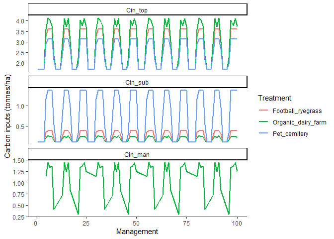

<!-- README.md is generated from README.Rmd. Please edit that file -->

# rCTOOL

<!-- badges: start -->

<!-- badges: end -->

rCTOOL is an open-source R package, that encapsulates the capabilities
of C-TOOL (Petersen, Olesen, and Heidmann 2002; Taghizadeh-Toosi et al.
2014) while addressing its implementation limitations. The aim consists
of providing a user-friendly interface, facilitates running multiple
scenarios, and offers comprehensive documentation and licensing
information. This package streamlines the use of C-TOOL, making it more
accessible and effective for potential users.


## Installation

You can install the development version of rCTOOL from
[GitHub](https://github.com/) with:

``` r
# install.packages("devtools")
devtools::install_github("francagiannini/rCTOOL")
```

## Basic toy example

This is a simple example of the potential use of rCTOOL. The example
corresponds to one of the treatments presented by (Jensen et al. 2021)
and (Jensen et al. 2022) containing the C inputs for the treatment of
the spring barley crop with 4 DM Mg/ha straw incorporated into the soil
at a long-term experimental station Askov, Denmark.

``` r
library(rCTOOL)
library(tidyverse)

# load data ----
data('basic_example')
data('scenario_temperature') # this is equivalent to set_monthly_temperature_data(coords=c(9.114015, 55.47163), yr_start=1951, yr_end=2019)
```

Below the basic_example and temperature data sets are exemplified.

``` r
head(basic_example, 2)
#>   mon  yrs id year Cin_top Cin_sub Cin_man manure_monthly_allocation
#> 1   1 1951  1 1951   3.566    0.39       0                         0
#> 2   2 1951  1 1952   3.566    0.39       0                         0
#>   plant_monthly_allocation
#> 1                        0
#> 2                        0
```

``` r
head(scenario_temperature, 2)
#> # A tibble: 2 × 6
#> # Groups:   month [2]
#>   month    yr  Tavg   Tmin  Tmax Range
#>   <dbl> <dbl> <dbl>  <dbl> <dbl> <dbl>
#> 1     1  1951  0.89 -0.7    2.48  3.18
#> 2     2  1951  1.17 -0.251  2.59  2.84
```

It is mandatory to define the time period, Carbon inputs (from manure
and/or plant), Management (months where the inputs are applied) and soil
configurations as well as temperature.

In this basic example, the temperature was already exported using the
package “easyclimate” for 1951-2019; basic_example contains the annual C
inputs from manure and plants, as well as their respective monthly
allocations.

``` r
# define timeperiod 
period <- define_timeperiod(yr_start = 1951, yr_end = 2019)

# get annual Carbon inputs 
cin <- define_Cinputs(management_filepath = basic_example)

# get management 
management <- management_config(management_filepath = basic_example, f_man_humification = 0.192)

# get soil configuration 
soil <- soil_config(Csoil_init = 105, # Initial C stock at 1m depth
                   f_hum_top =  0.533,
                   f_rom_top =  0.405,
                   f_hum_sub =  0.387,
                   f_rom_sub =  0.610,
                   Cproptop = 0.55, # landmarkensite report askov
                   clay_top = 0.11,
                   clay_sub = 0.20,
                   phi = 0.035,
                   f_co2 = 0.628,
                   f_romi = 0.012,
                   k_fom  = 0.12,
                   k_hum = 0.0028,
                   k_rom = 3.85e-5,
                   ftr = 0.0025)
```

We also need to initialize soil pools before the simulation starts.
Initial soil pools depend on the Carbon:Nitrogen ratio, the humification
and romification fractions in top- and subsoils as well as the initial C
stock.

``` r
# initialize soil pools
soil_pools <- initialize_soil_pools(cn = 12, soil_config = soil)
```

We can now start the monthly simulation. The verbose argument, currently
set to FALSE, provides a check mass-balance to ensure the model is
working correctly. \[Note to improve the mass balance, currently wrong\]

``` r
# run rCTOOL
output <- run_ctool(time_config = period,
                   cin_config = cin,
                   m_config = management,
                   t_config = scenario_temperature,
                   s_config = soil,
                   soil_pools = soil_pools,
                   verbose = F)
```

We can plot the results.

``` r
output |>
  mutate(time=make_date(year =yrs,month=mon)) |>
  ggplot(aes(x=time,y=C_topsoil))+
  geom_line()+
  geom_smooth()+
  theme_classic()
```


Let’s explore the output data frame.

Time period variables:

- `mon`: month of the year (1-12)
- `yrs`: year of the simulation

C fluxes variables by depth (Mg/ha):

- `C_topsoil`: Carbon stock in the topsoil (0-25 cm)
- `C_subsoil`: Carbon stock in the subsoil (26-100 cm)
- `SOC_stock`: Total Soil Organic Carbon stock in the soil (0-100 cm)
- `C_transport`: Carbon transported to the subsoil
- `em_CO2_top`: Total CO2 emissions from the topsoil
- `em_CO2_sub`: Total CO2 emissions from the subsoil
- `em_CO2_total`: Total CO2 emissions from the soil

C pools variables (Mg/ha):

Fresh Organic Matter (FOM) pool - `FOM_top`: FOM in the topsoil -
`FOM_top_decomposition`: Monthly decomposition of FOM in the topsoil -
`substrate_FOM_decomp_top`: Substrate for FOM decomposition in the
topsoil - `FOM_humified_top`: FOM that has been humified in the topsoil
(becomes part of topsoil HUM) - `em_CO2_FOM_top`: CO2 emissions from the
decomposition of FOM in the topsoil - `FOM_tr`: FOM transported from the
topsoil to the subsoil - `FOM_sub`: FOM in the subsoil -
`FOM_sub_decomposition`: Decomposition of FOM in the subsoil -
`substrate_FOM_decomp_sub`: Substrate for FOM decomposition in the
subsoil - `FOM_humified_sub`: FOM that has been humified in the subsoil
(becomes part of subsoil HUM) - `em_CO2_FOM_sub`: CO2 emissions from the
decomposition of FOM in the subsoil

Humified Organic Matter (HUM) pool - `HUM_top`: HUM in the topsoil -
`HUM_top_decomposition`: Decomposition of HUM in the topsoil -
`substrate_HUM_decomp_top`: Substrate for HUM decomposition in the
topsoil - `HUM_romified_top`: HUM that has been “romified” in the
topsoil (becomes part of topsoil ROM) - `em_CO2_HUM_top`: CO2 emissions
from the decomposition of HUM in the topsoil - `HUM_tr`: HUM transported
from the topsoil to the subsoil - `HUM_sub`: HUM in the subsoil -
`HUM_sub_decomposition`: Decomposition of HUM in the subsoil -
`substrate_HUM_decomp_sub`: Substrate for HUM decomposition in the
subsoil - `HUM_romified_sub`: HUM that has been “romified” in the
subsoil (becomes part of subsoil ROM) - `em_CO2_HUM_sub`: CO2 emissions
from the decomposition of HUM in the subsoil

Resistant Organic Matter (ROM) pool - `ROM_top`: ROM in the topsoil -
`ROM_top_decomposition`: Decomposition of ROM in the topsoil -
`substrate_ROM_decomp_top`: Substrate for ROM decomposition in the
topsoil - `em_CO2_ROM_top`: CO2 emissions from the decomposition of ROM
in the topsoil - `ROM_tr`: ROM transported from the topsoil to the
subsoil - `ROM_sub`: ROM in the subsoil - `ROM_sub_decomposition`:
Decomposition of ROM in the subsoil - `substrate_ROM_decomp_sub`:
Substrate for ROM decomposition in the subsoil - `em_CO2_ROM_sub`: CO2
emissions from the decomposition of ROM in the subsoil

## Comparing multiple scenarios toy example

Aiming to show how to run and compare multiple scenarios, we have set
ourselves the following challenge:

We have inherited an old field where cereals have been grown for many
many years and we want to increase C in Soil. We need to choose between…

- Creating a football pitch for students at AU Viborg recreation.

- Starting an organic dairy farm.

- Establishing a municipal (kommunal) pet cemetery…


Loading scenario management data for the there options.

``` r
# load data ----
data('scenario')
data('scenario_temperature') # this is equivalent to set_monthly_temperature_data(coords=c(9.114015, 55.47163), yr_start=1951, yr_end=2019)
```

The scenario data set contains three different C input estimation for
the different scenarios:

- For the football court scenario we assume a well-maintained stomped
  ryegrass cover,

- for the organic dairy farming we assume a crop rotation with grass,
  maize and cereals for happy milking cows,

- and finally for the pet cemetery we assume a less healthily reygrass
  and a certain number of beloved dogs and cats from Viborg municipality
  burred in the subsoil.

Now we will play with rCTOOL to explore the implications in terms of
soil C dynamics.

First lets take a look on the C inputs distribution:



Then we provide a simulation parameters to the different modules time
period, management, soil parameters and pools initial distribution.

``` r
period <-  define_timeperiod(yr_start = 1951, yr_end = 2019)

management <- management_config(
  manure_monthly_allocation = c(0, 0, 1, 0, 0, 0, 0, 0, 0, 0, 0, 0),
  plant_monthly_allocation = c(0, 0, 0, 8, 12, 16, 64, 0, 0, 0, 0, 0) / 100
) # set to default

soil <- soil_config(Csoil_init = 100,
                   f_hum_top = 0.4803,
                   f_rom_top = 0.4881,
                   f_hum_sub = 0.3123,
                   f_rom_sub = 0.6847,
                   Cproptop = 0.47,
                   clay_top = 0.1,
                   clay_sub = 0.15,
                   phi = 0.035,
                   f_co2 = 0.628,
                   f_romi = 0.012,
                   k_fom  = 0.12,
                   k_hum = 0.0028, 
                   k_rom = 3.85e-5,
                   ftr = 0.003)

soil_pools <- initialize_soil_pools(cn = 10, soil_config = soil)
```

Then we provide configuration for running each of the three
treatment/scenarios.

``` r
treatment <- unique(scenario$treatment)
cin_treatment <- lapply(treatment, function(x) { define_Cinputs(management_filepath = subset(scenario, treatment==x)) })
names(cin_treatment) <- treatment
```

Finally we run the simulation for each treatment/scenario.

``` r
output_treatment <- lapply(treatment, function(x) {
  output <- run_ctool(time_config = period, 
            cin_config = cin_treatment[[x]], 
            m_config = management, 
            t_config = scenario_temperature, 
            s_config = soil, 
            soil_pools = soil_pools)
  output$treatment = x
  return(output)
})

output_treatment <- data.table::rbindlist(output_treatment)
```

And the winning one is…

Lets explore:

``` r

plot_df <- output_treatment[, c('mon','yrs','C_topsoil','C_subsoil','em_CO2_total', 'treatment')]
plot_df <- reshape2::melt(plot_df, c('mon','yrs','treatment'))

labels <- c(
  C_topsoil = 'SOC topsoil',
  C_subsoil = 'SOC subsoil',
  em_CO2_total = 'CO2 emissions'
)

ggplot(plot_df, aes(x=yrs, y=value, colour=treatment)) + 
  geom_point(size=0.02, alpha=0.2) + 
  geom_smooth() +
  facet_wrap(variable~., scales = 'free_y', ncol = 1,
             labeller = as_labeller(labels)) + 
  labs(x='Years', y='Output (Mg/ha)', colour='Treatment') + 
  scale_x_continuous(breaks=c(1960, 2010))+ 
  theme_classic() 
```


# References

<div id="refs" class="references csl-bib-body hanging-indent"
entry-spacing="0">

<div id="ref-jensen22" class="csl-entry">

Jensen, Johannes L., Jørgen Eriksen, Ingrid K. Thomsen, Lars J.
Munkholm, and Bent T. Christensen. 2022. “Cereal Straw Incorporation and
Ryegrass Cover Crops: The Path to Equilibrium in Soil Carbon Storage Is
Short.” Journal Article. *European Journal of Soil Science* 73 (1).
<https://doi.org/10.1111/ejss.13173>.

</div>

<div id="ref-jensen21" class="csl-entry">

Jensen, Johannes L., Ingrid K. Thomsen, Jørgen Eriksen, and Bent T.
Christensen. 2021. “Spring Barley Grown for Decades with Straw
Incorporation and Cover Crops: Effects on Crop Yields and n Uptake.”
Journal Article. *Field Crops Research* 270.
<https://doi.org/10.1016/j.fcr.2021.108228>.

</div>

<div id="ref-petersen1ctool" class="csl-entry">

Petersen, Bjørn M., Jørgen E. Olesen, and Tove Heidmann. 2002. “A
Flexible Tool for Simulation of Soil Carbon Turnover.” Journal Article.
[www.elsevier.com/locate/ecolmodel](https://www.elsevier.com/locate/ecolmodel).

</div>

<div id="ref-tagctool2" class="csl-entry">

Taghizadeh-Toosi, Arezoo, Bent T. Christensen, Nicholas J. Hutchings,
Jonas Vejlin, Thomas Kätterer, Margaret Glendining, and Jørgen E.
Olesen. 2014. “C-TOOL: A Simple Model for Simulating Whole-Profile
Carbon Storage in Temperate Agricultural Soils.” Journal Article.
*Ecological Modelling* 292: 11–25.
https://doi.org/<https://doi.org/10.1016/j.ecolmodel.2014.08.016>.

</div>

</div>
